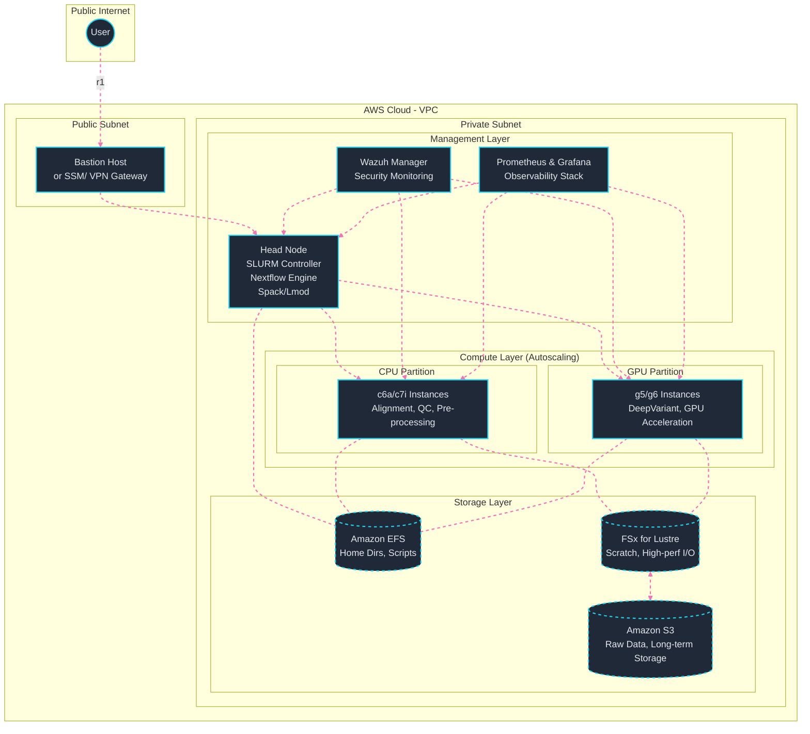

# Genomic Workflow Deployment on AWS ParallelCluster Using Nextflow and SLURM

## Overview

This documentation provides a comprehensive design guide for building a **scalable, secure, and reproducible High-Performance Computing (HPC) environment** on Amazon Web Services (AWS), specifically tailored for **Genomic Nextflow workflows**.

The core of the infrastructure is built using **AWS ParallelCluster**, managed as Infrastructure as Code (IaC) via **Terraform**.

**Published documentation:** https://naratech-platforms.gitbook.io/genomics-nf-hpc-on-aws-parallelcluster/

- **Production-grade genomic variant discovery pipeline**
- **AWS ParallelCluster with SLURM scheduler**
- **CPU and GPU partitions for optimized workload execution**
- **Nextflow workflow orchestration**
- **Spack + Lmod for software management**
- **FSx for Lustre and EFS for high-performance storage**
- **Wazuh security monitoring on ECS Fargate**
- **Prometheus/Grafana observability stack**

## Architecture Diagram



## Quick Navigation

| Section | Description |
|---------|-------------|
| [Project Overview](docs/01-project-overview.md) | Objectives, design principles, and target audience |
| [System Architecture](docs/02-architecture.md) | Component breakdown and deployment model |
| [Technology Stack](docs/03-tech-stack.md) | Compute, storage, and software decisions |
| [Terraform Provisioning](docs/04-terraform.md) | Infrastructure as Code setup |
| [Workflow Design](docs/05-workflow.md) | Nextflow pipeline execution flow |
| [Security & Observability](docs/06-security-observability.md) | Wazuh, Prometheus, and Grafana integration |
| [Cost Optimization](docs/07-cost-optimization.md) | Strategies for minimizing TCO |
| [Conclusion](docs/08-conclusion.md) | Summary and future enhancements |
| [References](docs/09-references.md) | External resources and citations |
| [Developer Guidance](docs/10-developer-guidance.md) | SSM access, SLURM, and GPU management |
| [Troubleshooting](docs/11-troubleshooting-gpu.md) | GPU and CUDA issue resolution |
| [Validation Checklist](docs/12-validation-checklist.md) | Post-deployment verification steps |
| [Ansible Post-Provisioning](docs/13-ansible.md) | Post-provision configuration and Lmod setup |

## Getting Started

1. Review the [Project Overview](docs/01-project-overview.md) to understand the goals
2. Study the [System Architecture](docs/02-architecture.md) for component understanding
3. Follow the [Terraform Provisioning](docs/04-terraform.md) guide to deploy infrastructure
4. Use the [Validation Checklist](docs/12-validation-checklist.md) to verify deployment

## Repository Structure

```
hpc-genomics-nf/
├── README.md            # Project overview (this file)
├── docs/                # GitBook documentation
├── ansible/             # Post-provision configuration
├── terraform/           # Infrastructure as Code
├── nextflow/            # Pipeline definitions
└── modules/             # Reusable components
```

