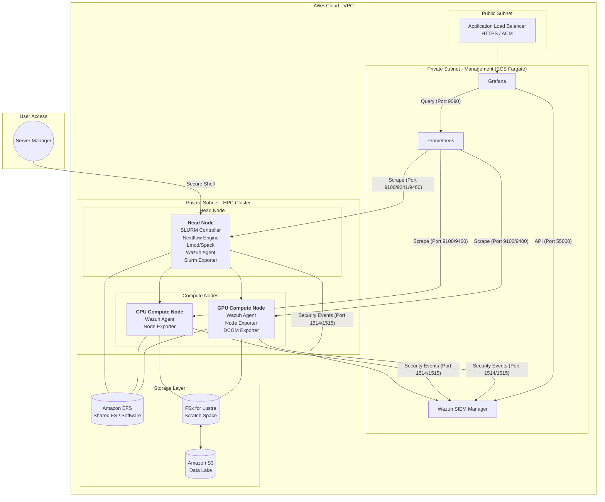
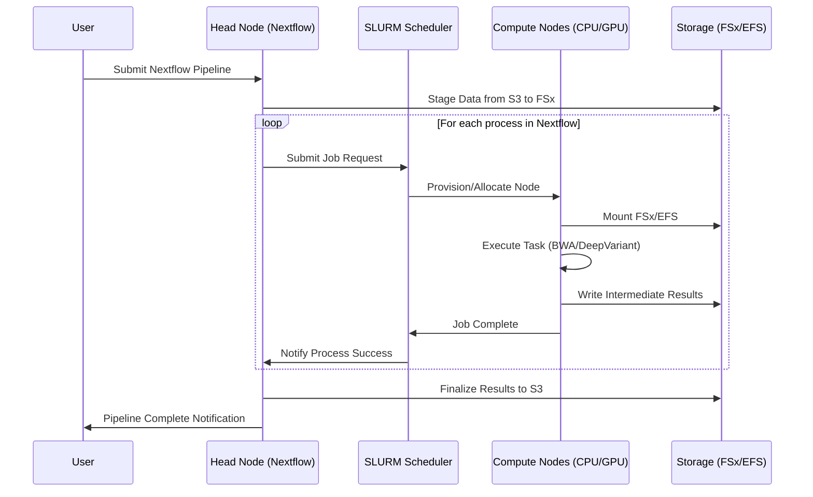

# System Architecture

The system is designed as a hybrid architecture within a Virtual Private Cloud (VPC), separating the transient, high-performance HPC cluster from the persistent, containerized management services (Wazuh, Prometheus, Grafana) hosted on **AWS ECS Fargate**. This separation enhances security, reduces overhead on the Head Node, and simplifies the deployment and scaling of the management stack.

---

## High-Level Architecture Diagram

The following diagram illustrates the primary components and their interactions, highlighting the segregation of the HPC cluster and the ECS Fargate management layer, and the use of AWS Systems Manager (SSM) for secure, keyless access.

[High-Level System Architecture Diagram with SSM and ECS Fargate](../assets/hpc_arch_final.png)

---

## System Design Flow (Sequence)

---

## Component Breakdown

The architecture is logically divided into three main layers: the HPC Cluster, the Containerized Management Plane, and the Storage Layer.

| Component | Layer | Role | Key Function |
| :--- | :--- | :--- | :--- |
| **AWS ParallelCluster** | HPC Cluster | Orchestration | Manages the lifecycle of the entire HPC cluster, including Head Node, Compute Nodes, and networking. |
| **Head Node** | HPC Cluster | Management/Control | Hosts the SLURM Controller, the Nextflow execution engine, and the Spack/Lmod software stack. Acts as the primary access point for users and managers (via SSM). |
| **Compute Nodes** | HPC Cluster | Execution | Autoscaled EC2 instances (CPU and GPU) that execute Nextflow processes submitted via SLURM. Accessed by managers for diagnostics (via SSM). |
| **SLURM Scheduler** | HPC Cluster | Resource Management | Manages job queues, resource allocation, and autoscaling of Compute Nodes based on job requirements. |
| **Wazuh SIEM Manager** | Containerized Management | Security | Deployed on **ECS Fargate** to function as a **Security Information and Event Management (SIEM)** system for centralized logging and security event analysis. |
| **Prometheus** | Containerized Management | Metrics Database | Deployed on **ECS Fargate** to scrape metrics from HPC nodes (via exporters) and store time-series data. |
| **Grafana** | Containerized Management | Visualization | Deployed on **ECS Fargate** with a public endpoint (protected by ALB/Route53/ACM) for secure, centralized access to monitoring dashboards. |
| **Amazon FSx for Lustre** | Storage Layer | High-Performance Storage | Provides a high-throughput, low-latency scratch space for intermediate and final genomic data. |
| **Amazon EFS** | Storage Layer | Shared Storage | Provides persistent storage for user home directories, configuration files, and shared scripts. |
| **Amazon S3** | Storage Layer | Data Lake/Archive | Serves as the source for raw genomic data and the final destination for processed results and archives. |

---

## Management Plane Deployment (ECS Fargate)

The decision to deploy the observability and security management plane on **ECS Fargate** offers several advantages:

- **Decoupling:** Separates the critical HPC workload from the management services, ensuring the Head Node remains dedicated to scheduling and workflow orchestration.
- **Zero Cluster Overhead:** Fargate is serverless compute for containers, eliminating the need to manage EC2 instances for the management services.
- **Scalability and Resilience:** ECS handles the scaling and health checks for the Wazuh Manager, Prometheus, and Grafana containers.
- **Secure Access:** Grafana is exposed via a public Application Load Balancer (ALB) and secured with **Route53** and **AWS Certificate Manager (ACM)** for TLS/HTTPS, providing secure, authenticated access to dashboards without exposing the Head Node.

---

## Secure Access via AWS Systems Manager (SSM)

All administrative and user access to the Head Node and Compute Nodes is facilitated through **AWS Systems Manager Session Manager**. This approach eliminates the need for a Bastion Host and SSH keys, enhancing the security posture by:

- **Removing Inbound Ports:** No inbound SSH port (22) is required on the security groups.
- **IAM-Based Authentication:** Access is controlled entirely by IAM policies, providing granular, auditable, and keyless access.
- **Centralized Auditing:** All session activity is logged and auditable via AWS CloudTrail.

---

## Scheduling Model

| Partition | Purpose | Instance Type | Workloads |
| :--- | :--- | :--- | :--- |
| **CPU** | General compute | c6a/c7i, Graviton3 | Alignment, QC, preprocessing |
| **GPU** | Accelerated compute | g5/g6 | DeepVariant, GPU-accelerated tasks |

Both partitions leverage SLURM's autoscaling capabilities through AWS ParallelCluster:
- Nodes are launched on job submission
- Idle timeout minimizes cost
- CPU and GPU queues scale independently
